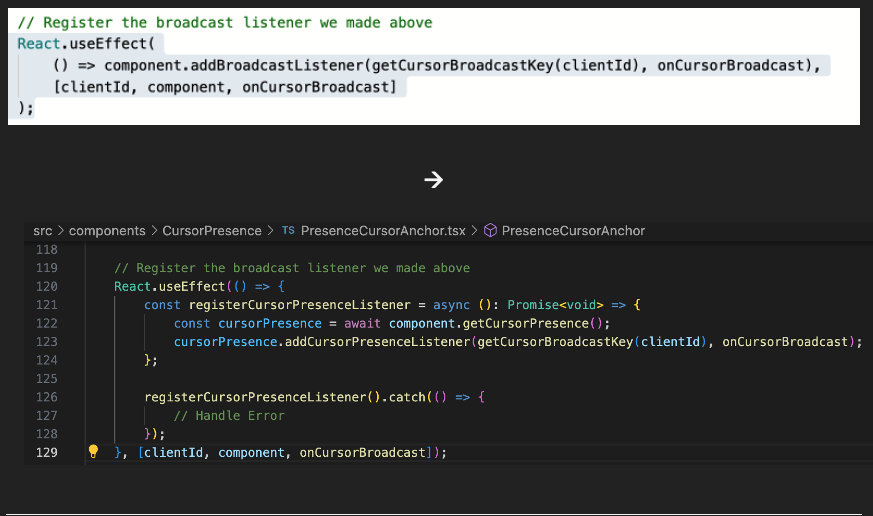
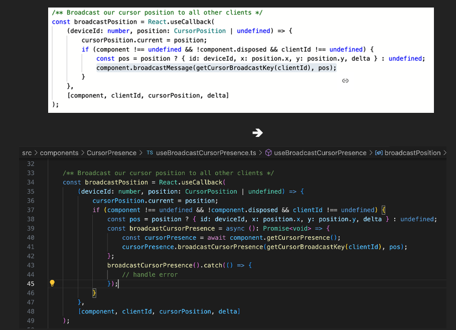

## Specialized Cursor API

The required pieces of functionality that a low-cogs DDS would need replace is all found at the [BroadcastManager](https://dev.azure.com/intentional/intent/_git/whiteboard-app?path=/src/fluid/BroadcastManager.ts&_a=contents&version=GBmaster)
layer of Whiteboard's current raw-signal based solution.
This new solution should include the ability to:
(1) broadcast keyed cursor position updates,
(2) add (and remove) listeners for specific cursor broadcast keys,
(3) set the frequency at which batched messages are broadcasted.

This API would be inserted [here](https://dev.azure.com/intentional/intent/_git/whiteboard-app?path=/src/components/CursorPresence/PresenceCursorAnchor.tsx&version=GBmaster&line=120&lineEnd=123&lineStartColumn=1&lineEndColumn=4&lineStyle=plain&_a=contents)
and [here](https://dev.azure.com/intentional/intent/_git/whiteboard-app?path=/src/components/CursorPresence/useBroadcastCursorPresence.ts&version=GBmaster&line=39&lineEnd=39&lineStartColumn=5&lineEndColumn=70&lineStyle=plain&_a=contents)
to add listeners and broadcast messages:

**Note:** getCursorPresence returns a Promise which resolves to an object of type WhiteboardCursorPresence Object.

Other feature requirements such as viewport to canvas coordinate translation, global panning/zoom state maintenance,
interpolation of intermediate cursor positions (for smooth cursor animations/transitions), and cursor inactivity timeout
should be handled by the customer.

**Note:** With internal throttling, we also can replace their [useTrailingThrottle](https://dev.azure.com/intentional/intent/_git/whiteboard-app?path=/src/components/CursorPresence/useBroadcastCursorPresence.ts&version=GBmaster&line=148&lineEnd=182&lineStartColumn=1&lineEndColumn=1&lineStyle=plain&_a=contents)
function.

